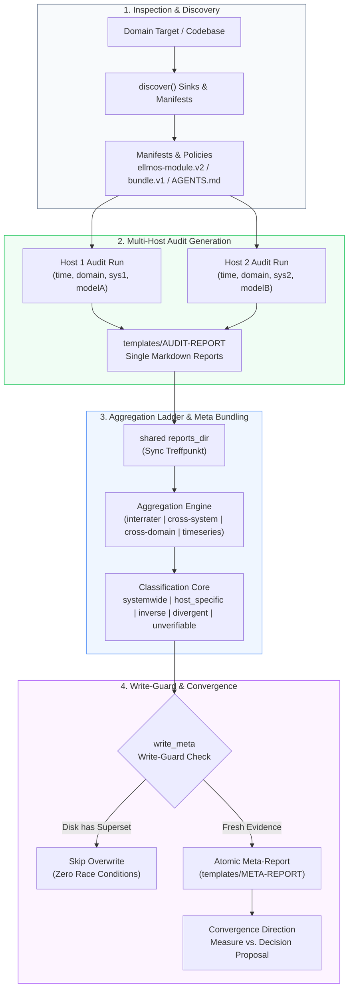
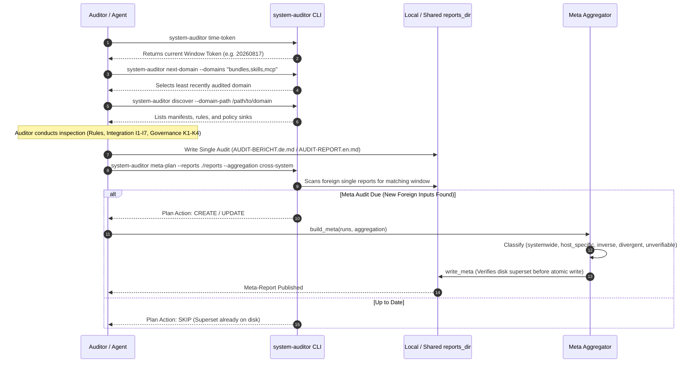

# system-auditor

[](https://github.com/ellmos-ai/system-auditor/actions/workflows/ci.yml)
[](tests/)
[](pyproject.toml)
[](pyproject.toml)
[](SECURITY.md)
[](SECURITY.md)
[](LICENSE)
[-lightgrey)](pyproject.toml)
[](https://github.com/ellmos-ai)
[](https://github.com/open-bricks/open-bricks)
[](pyproject.toml)
[](llms.txt)

**Evidence-based system audits across several machines — with meta bundling.**

*[Deutsche Fassung: `README_de.md`](README_de.md)*

---

## 🧭 Quick Navigation

- [Why This Exists](#why-this-exists)
- [Architecture & System Flow](#architecture--system-flow)
- [The Three Stages](#the-three-stages)
- [Four Tokens & Discrete Windows](#four-tokens--discrete-windows)
- [The Aggregation Ladder](#the-aggregation-ladder)
- [Key Capabilities & Governance Invariants](#key-capabilities--governance-invariants)
- [One Current Answer Per Window](#one-current-answer-per-window)
- [Write-Guard Race Protection](#write-guard-race-protection)
- [End-to-End Audit Lifecycle](#end-to-end-audit-lifecycle)
- [Sibling Tools & Ecosystem Matrix](#sibling-tools--ecosystem-matrix)
- [Installation & CLI Usage](#installation--cli-usage)
- [Configuration](#configuration)
- [Security & Privacy](#security--privacy)
- [Development & Verification](#development--verification)
- [License](#license)

---

## Why This Exists

The auditor examines a composed system in **three directions**:

1. **Rule compliance:** Does an observed system state violate a declared policy or convention?
2. **Integration (classes I1–I7):** Do software modules, manifests, bundles, and bindings collaborate in practice as declared?
3. **Governance consistency (classes K1–K4):** Are control files, registries, policies, and past architectural decisions consistent with each other?

The guiding principle is **convergence**: every finding ends with a clear direction — adapt reality to the rule (a concrete measure) or adapt the rule to reality (a decision proposal).

Two machines auditing the same domain do **not** produce the same result. That is not a defect — it is the most useful thing about running audits across multiple systems.

### A Measured Example

> **Finding:** *"Gardener governance hardcodes the laptop home path"* — `AGENTS.md` points at `C:\Users\alice\…`.
>
> On **WORKSTATION-LG** this is real: the path does not exist there.
> On the **laptop** the very same line is correct and produces no finding at all.

A single machine can only ever see one half of that reality. Comparing the valid audits of all participating systems yields an evidence-based classification no single run can produce:

| Class | Meaning | Impact |
|---|---|---|
| `systemwide` | Every participant found it | Genuine systemwide defect or broken invariant |
| `host_specific` | Some found it, others verified clean | Configuration drift or host divergence |
| `inverse` | A defect on host A, explicitly fine on host B | Host dependency (e.g. hardcoded path) |
| `divergent` | Same location, *different* rules broken | Differing sync state or conflicting policy reading |
| `unverifiable` | A participant never inspected that location | Honest absence of proof (prevents false drift claims) |

> [!NOTE]
> `unverifiable` is the honest rung. Without it, every gap in a participant's test coverage would silently masquerade as a real divergence between systems.

---

## Architecture & System Flow



---

## The Three Stages

```text
map      what is there            ->  system-explorer   (optional)
verdict  what is wrong about it   ->  system-auditor    (this module)
measure  what we do about it      ->  ticket system     (optional)
```

A map is value-free; a ticket is an action. In between sits the judgment: *which rule is violated, what do we recommend, and is the rule itself still right?*

**Nothing here requires its neighbours.** Detected, they are used; absent, the auditor reads directly and writes files. Same pattern in every direction: *know them, don't need them.*

---

## Four Tokens & Discrete Windows

Every audit answers four questions, and each answer is an immutable token:

| Token | Question | Description |
|---|---|---|
| `time` | *When?* | The discrete period window this statement belongs to (e.g. `20260817`) |
| `domain` | *What?* | The domain that was audited (e.g. `bundles`, `skills`, `mcp`) |
| `system` | *Where?* | The machine name or environment inspected (e.g. `WORKSTATION-LG`) |
| `auditor` | *Who?* | The model or agent identity that conducted the audit (e.g. `claude-3-5-sonnet`) |

### Why Discrete Windows Instead of Sliding Spans

A sliding window ("valid for 14 days from run") makes overlap a matter of degree — every machine has to compare pairs to resolve status. A window **grid** derived from configuration turns that into a direct lookup: ask the clock, get a token. Two machines that never talk to each other derive the same token for the same moment, turning "same period" into a fast string comparison instead of a distributed consensus problem.

---

## The Aggregation Ladder

Hold some tokens fixed, let the rest vary. **An aggregation may only attribute a cause when exactly one dimension varies** — otherwise a difference is mathematically unidentifiable. This rule is enforced in the constructor.

| Aggregation | Fixed Dimensions | Varying Dimension | What It Identifies |
|---|---|---|---|
| `interrater` | `time` + `domain` + `system` | **`auditor`** | Do two AI models agree on the same machine? |
| `cross-system-rater` | `time` + `domain` + `auditor` | **`system`** | A clean, controlled host effect |
| `cross-system` | `time` + `domain` | **`system`** | Machine variance (model uncontrolled; practical) |
| `cross-domain` | `time` + `system` + `auditor` | **`domain`** | Is the same rule violated across distinct domains? |
| `timeseries` | `system` + `domain` | **`time`** | How did this domain develop over consecutive windows? |
| `timeseries-rater` | `system` + `domain` + `auditor` | **`time`** | Domain trajectory through the lens of one model |
| `full-system` | `time` + `system` | `domain` **+** `auditor` | **Descriptive only** — inventory (`build_inventory`), no verdict |

---

## Key Capabilities & Governance Invariants

| Capability / Invariant | Guarantee | Technical Implementation |
|---|---|---|
| **Deterministic Classification** | Same input reports produce bit-for-bit identical classifications | Canonical sorting of findings and inputs prior to evaluation |
| **Identifiability Guard** | Aggregations with >1 varying dimension cannot issue causal verdicts | `Aggregation` class validates variation arity in constructor |
| **Zero-Lock Concurrency** | Multi-host audits run asynchronously without centralized lock servers | Write-guard re-reads target file before writing to check input superset |
| **Zero Network Egress** | 100% offline; zero telemetry or external HTTP traffic | Standard library only; verified by static AST contract tests |
| **Bilingual Governance** | English and German report templates and documentation parity | Dual templates in `templates/` and bilingual prompts in `prompts/` |
| **Coverage Transparency** | Uninspected locations explicitly reported as `unverifiable` | `MetaResult` tracks verified presence, verified absence, and unverified areas |

---

## One Current Answer Per Window

```text
system A audits `bundles`   ->  single audit
system B audits `bundles`   ->  meta-2  (created)
system C audits `bundles`   ->  meta-3  (same file, rewritten)
```

Within a window the meta-audit is **overwritten, not archived**: "what do we know about this domain in this window" has one current authoritative answer. Keeping `meta-2` beside `meta-3` would leave conflicting answers to the same question.

**History keeps itself.** The previous window has a different time token, hence a different filename, and stays untouched.

---

## Write-Guard Race Protection

Parallel audits of one domain are the *premise* of a meta-audit, not a collision. There is nothing to exclude, so this module holds no distributed locks.

- **The audit itself is read-only.** Nothing in the audited domain is modified.
- **The classification is deterministic.** Same inputs yield identical markdown outputs.
- **Write-Guard verification:** `write_meta` re-reads the destination on disk. If the file on disk already rests on a superset of the planned inputs (e.g. written by a faster concurrent run), it safely skips rewriting.

---

## End-to-End Audit Lifecycle



---

## Sibling Tools & Ecosystem Matrix

`system-auditor` is part of the `ellmos-ai` ecosystem under the `open-bricks` umbrella:

| Repository | Focus | Integration Role with `system-auditor` |
|---|---|---|
| [`ellmos-ai/system-explorer`](https://github.com/ellmos-ai/system-explorer) | System Mapping | Provides structured inventory maps ("what is there") |
| [`ellmos-ai/system-auditor`](https://github.com/ellmos-ai/system-auditor) | Audit & Verdict | Evaluates compliance, integration, and governance consistency |
| [`ellmos-ai/ellmos-controlcenter-mcp`](https://github.com/ellmos-ai/ellmos-controlcenter-mcp) | MCP Control Plane | Context packing, tool routing, and capability discovery |
| [`ellmos-ai/ellmos-delegation-authority`](https://github.com/ellmos-ai/ellmos-delegation-authority) | Cryptographic Authority | Nonce-based cryptographic delegation grants |
| [`ellmos-ai/sqlite-transit-sync`](https://github.com/ellmos-ai/sqlite-transit-sync) | Database Transit | Zero-egress WAL-checkpointed SQLite replication |
| [`dev-bricks/automation-master`](https://github.com/dev-bricks/automation-master) | Task Automation | Orchestrates automated batch maintenance workflows |
| [`dev-bricks/automizer-for-claude-desktop`](https://github.com/dev-bricks/automizer-for-claude-desktop) | Process Discrimination | Atomic configuration snapshots & safe execution queues |
| [`file-bricks/ProSync`](https://github.com/file-bricks/ProSync) | Local Backup | Safe multi-profile sync and SQLite WAL checkpoint protection |
| [`doc-bricks/CleanMarkdown`](https://github.com/doc-bricks/CleanMarkdown) | Document AST | High-fidelity Markdown AST validation and clean rendering |
| [`open-bricks/open-bricks`](https://github.com/open-bricks/open-bricks) | Umbrella Organization | Common architecture standards, governance, and licensing |

---

## Installation & CLI Usage

```bash
# Editable install
python -m pip install -e .

# Display active configuration and resolved reports directory
system-auditor config

# Query current discrete time window token
system-auditor time-token

# Determine the next due domain in rotation
system-auditor next-domain --domains "bundles,skills,mcp" --reports ./reports --system $HOSTNAME

# Discover conventions, manifests, and policy sinks for a domain
system-auditor discover --domain-path /path/to/domain

# Plan pending meta-audits in current window
system-auditor meta-plan --reports ./reports --aggregation cross-system
system-auditor meta-plan --reports ./reports --aggregation interrater

# Identify single audits belonging to previous windows
system-auditor stale --reports ./reports --system $HOSTNAME
```

---

## Configuration

```bash
cp config/system-auditor.config.example.json system-auditor.config.json
system-auditor config          # shows resolved config
```

Config lookup order: `--config`, `SYSTEM_AUDITOR_CONFIG`, `./`, `./config/`, `~/.system-auditor/`.

```json
{
  "time_grid": {
    "unit": "weeks",
    "step": 1,
    "anchor": "2026-01-05"
  },
  "reports_dir": "./reports",
  "policy": {
    "cross-system": "always",
    "interrater": "always",
    "cross-domain": "on-demand"
  }
}
```

> [!IMPORTANT]
> `reports_dir` is the multi-host meeting point. It must reside in a cloud-synchronized folder shared across participating machines. In a host-local directory, meta-audits cannot aggregate foreign reports.

---

## Security & Privacy

`system-auditor` is built with a strict **Local-First & Zero-Egress** model. It contains zero telemetry, requires zero network connectivity, operates with unprivileged user permissions, and employs deterministic write-guards.

For full details, supported versions, and vulnerability disclosure contacts, see [`SECURITY.md`](SECURITY.md).

---

## Development & Verification

```bash
# Run pytest test suite (including metadata contract tests)
python -m pytest -q

# Run Ruff linter
ruff check src tests
```

---

## License

MIT — see [LICENSE](LICENSE).
