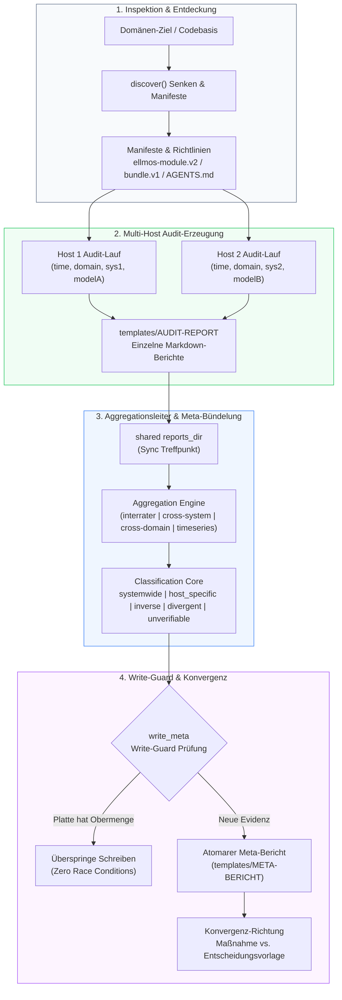
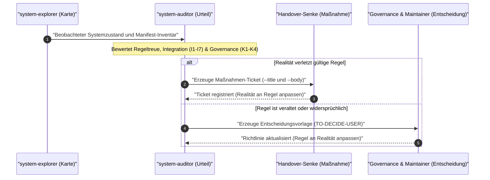
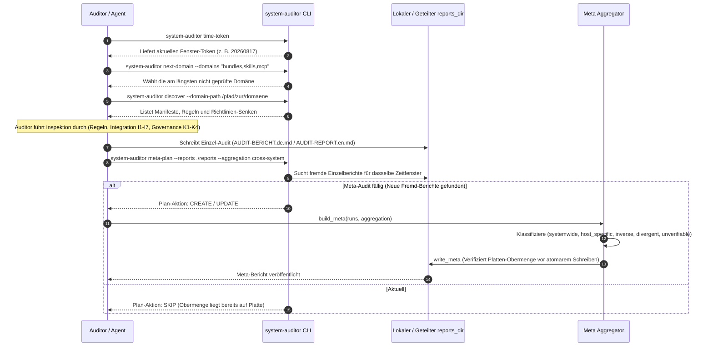

<!-- alternate banner: assets/banner-b.svg (swap on occasion) -->

# system-auditor

[](https://github.com/ellmos-ai/system-auditor/actions/workflows/ci.yml)
[](tests/)
[](pyproject.toml)
[](pyproject.toml)
[](SECURITY.md)
[](SECURITY.md)
[](SECURITY.md)
[](https://github.com/astral-sh/ruff)
[](LICENSE)
[](NOTICE)
[-lightgrey)](pyproject.toml)
[](https://github.com/ellmos-ai)
[](https://github.com/open-bricks/open-bricks)
[](pyproject.toml)
[](llms.txt)
[](MARKETING-LOG.txt)

**Belegbasierte Systemaudits über mehrere Maschinen — mit Meta-Bündelung.**

*[English Version: `README.md`](README.md)*

---

## Schnellnavigation

1. [Überblick](#sec-01)
2. [Kernfähigkeiten & Nutzenversprechen](#sec-02)
3. [Zielgruppen & Discoverability](#sec-03)
4. [Vergleichsmatrix mit Alternativen](#sec-04)
5. [Governance & Laufzeit-Invarianten](#sec-05)
6. [Architektur & Systemfluss](#sec-06)
7. [Die drei Stufen & Handover-Vertrag](#sec-07)
8. [Vier Token & Diskrete Zeitfenster](#sec-08)
9. [Die Aggregationsleiter](#sec-09)
10. [Eine gültige Antwort je Zeitfenster](#sec-10)
11. [Schreibsicherung gegen Race Conditions](#sec-11)
12. [End-to-End Audit-Lebenszyklus](#sec-12)
13. [Geschwisterwerkzeuge & Ökosystem-Matrix](#sec-13)
14. [Installation & CLI-Nutzung](#sec-14)
15. [Konfiguration & Handover-Vertrag](#sec-15)
16. [Sicherheit, Datenschutz & Level 1 SBOM](#sec-16)
17. [Entwicklung & Verifikation](#sec-17)
18. [Lizenz, Maintainer & Starter](#sec-18)

---

<a id="sec-01"></a>
<a id="1-ueberblick"></a>
<a id="ueberblick"></a>
### 1. Überblick

Der Auditor prüft ein komponiertes System in **drei Richtungen**:

1. **Regeltreue:** Verletzt ein beobachteter Systemzustand eine deklarierte Richtlinie oder Konvention?
2. **Integration (Klassen I1–I7):** Arbeiten Software-Module, Manifeste, Bündel und Bindeglieder in der Praxis so zusammen wie deklariert?
3. **Governance-Konsistenz (Klassen K1–K4):** Sind Steuerdateien, Register, Richtlinien und vergangene Architekturentscheidungen untereinander widerspruchsfrei?

Das Leitprinzip ist **Konvergenz**: Jeder Befund endet mit einer klaren Richtung — Realität an die Regel anpassen (eine konkrete Maßnahme) oder die Regel an die Realität anpassen (eine Entscheidungsvorlage).

Zwei Maschinen, die dieselbe Domäne prüfen, liefern **nicht** dasselbe Ergebnis. Das ist kein Mangel — es ist der größte Nutzen verteilter Audits über mehrere Systeme.

#### Ein gemessenes Beispiel

> **Befund:** *„Gardener-Governance hardcodet den Laptop-Pfad"* — `AGENTS.md` verweist auf `C:\Users\alice\…`.
>
> Auf **WORKSTATION-LG** existiert der Pfad nicht: Ein echter Fehler.
> Auf dem **Laptop** ist exakt dieselbe Zeile korrekt und erzeugt keinerlei Befund.

Eine einzelne Maschine sieht immer nur eine Hälfte der Realität. Der Vergleich der gültigen Audits aller teilnehmenden Systeme ermöglicht eine belegbasierte Klassifikation, die kein Einzellauf treffen kann:

| Klasse | Bedeutung | Auswirkung |
|---|---|---|
| `systemwide` | Auf allen Systemen aufgetreten | Echter systemweiter Defekt oder verletzte Invariante |
| `host_specific` | Auf manchen gefunden, auf anderen sauber belegt | Konfigurations-Drift oder Host-Divergenz |
| `inverse` | Auf Host A ein Defekt, auf Host B explizit in Ordnung | Host-Abhängigkeit (z. B. hardcodierter Pfad) |
| `divergent` | Gleicher Ort, aber *verschiedene* Regeln verletzt | Unterschiedlicher Sync-Stand oder widersprüchliche Richtlinienauslegung |
| `unverifiable` | Ein Teilnehmer hat diesen Ort nie geprüft | Ehrliche Abwesenheit von Belegen (verhindert Fehlalarme bezüglich Drift) |

> [!NOTE]
> `unverifiable` ist die ehrliche Stufe. Ohne sie würde jede Lücke in der Testabdeckung eines Teilnehmers fälschlicherweise als reale Divergenz zwischen Systemen gewertet.

---

<a id="sec-02"></a>
<a id="2-kernfaehigkeiten"></a>
<a id="kernfaehigkeiten"></a>
### 2. Kernfähigkeiten & Nutzenversprechen

- **Multi-Host Aggregationsleiter:** Nahtlose Aggregation von Einzelberichten zu kausalen Urteilen ohne verteilte Locking-Daemons oder zentrale Datenbanken.
- **Modellmanuelle Interrater-Intelligenz:** Vergleich von Urteilen unterschiedlicher KI-Modelle (z. B. Claude, Gemini, GPT) bei konstantem System und konstanter Domäne zur Aufdeckung kognitiver Rater-Verzerrungen.
- **Null Laufzeit-Abhängigkeiten:** Reine Python-Standardbibliothek (`dependencies = []`). Keine externen Wheels zur Laufzeit erforderlich.
- **100% Local-First & Zero-Egress:** Funktioniert in vollständig isolierten Air-Gap-Umgebungen ohne Netzwerkzugriffe, Telemetrie oder Cloud-Tracking.
- **Schreibsicherung gegen Race Conditions:** Parallele Audits auf verschiedenen Maschinen kollidieren nicht; die Schreibsicherung prüft den Plattenstand und überspringt redundante Schreibvorgänge, wenn bereits eine Obermenge existiert.
- **Deterministische Diskrete Zeitfenster:** Ersetzt fehleranfällige Gleitzeitfenster durch berechnete Kalenderfenster-Token direkt aus der Systemuhr.
- **Konvergenz-Handover-Pipeline:** Entkoppelte Übergabe an Ticket-Warteschlangen (Maßnahmen) oder Governance-Dateien (Entscheidungsvorlagen) über schlanke CLI-Befehlsverträge.

---

<a id="sec-03"></a>
<a id="3-zielgruppen"></a>
<a id="zielgruppen"></a>
### 3. Zielgruppen & Discoverability

`system-auditor` richtet sich an Entwickler und Administratoren komplexer, heterogener Multi-Maschinen-Umgebungen:

| Zielgruppe | Typische Herausforderung | Lösung durch `system-auditor` |
|---|---|---|
| **Multi-Agenten-Flottenbetreiber** | Auditierung autonomer KI-Agenten über mehrere Rechner ohne verteilte Sperrmechanismen | Ableitung diskreter Zeitfenster-Token und belegbasierte Aggregation ohne Lock-Daemons |
| **System- & DevOps-Architekten** | Erkennung von Konfigurations-Drift und hardcodierten Host-Pfaden zwischen Workstations und Laptops | Klassifikation von Multi-Host-Befunden in `systemwide`, `host_specific`, `inverse` und `unverifiable` |
| **Open-Source-Maintainer** | Durchsetzung einheitlicher Governance, Lizenztreue und SBOM-Hygiene über Dutzende Repositories | Dependency-freies CLI-Tool mit automatisierter Domänen-Erkennung und Level 1 SBOM-Zertifizierung |
| **Local-First- & Datenschutz-Teams** | Gewährleistung strikter Zero-Egress-Richtlinien und unprivilegierter Ausführung | Garantierte Offline-Architektur, abgesichert durch statische AST-Import-Gates |

---

<a id="sec-04"></a>
<a id="4-vergleichsmatrix"></a>
<a id="vergleichsmatrix"></a>
### 4. Vergleichsmatrix mit Alternativen

| Funktion / Dimension | `system-auditor` | osquery | Lynis | Chef InSpec | OpenSCAP |
|---|---|---|---|---|---|
| **Primäre Architektur** | **Local-First / Multi-Host Meta-Bündelung** | SQL-Betriebssystem-Audit | Shell-Sicherheitsscanner | Ruby Infrastruktur-Tests | SCAP Konformitäts-Engine |
| **Laufzeit-Abhängigkeiten** | **Null (Python-Standardbibliothek)** | C++ Laufzeit & Binaries | Bash / POSIX Shell | Komplette Ruby-Runtime & Gems | C-Bibliotheken & Python-Bindings |
| **Multi-Host Aggregation** | **Native Aggregationsleiter** | Zentraler Fleet-Server erforderlich | Zentraler Enterprise-Server | Chef Automate Server | Red Hat Satellite / Spacewalk |
| **KI-Interrater-Varianz** | **Integriert (`auditor`-Token)** | Nicht unterstützt | Nicht unterstützt | Nicht unterstützt | Nicht unterstützt |
| **Privilegien-Anforderung** | **Unprivilegiert (`RunAsInvoker`)** | Root / Administrator erforderlich | Root bevorzugt / erforderlich | Root / SSH mit Privilegien | Root / Privilegierter Agent |
| **Nebenläufigkeits-Modell** | **Schreibsicherung (Zero Locks)** | Dateisperren / OS-Daemon | Sequentielle Ausführung | Sequentieller Runner | Einzelprozess-Sperre |
| **Transparente Nicht-Belegbarkeit** | **Ehrliche `unverifiable`-Klasse** | Fehlende Zeilen ohne Nachweis | Warnung / Überspringen | Übersprungener Kontrollblock | Ungeprüfter Regelzustand |
| **Konvergenz-Steuerung** | **Bilateral (Maßnahme vs Entscheidung)** | SQL-Ergebnisstrom | Unilaterale Skripte | Exit-Code bei Fehler | XML / HTML Bericht |
| **Netzwerk-Egress** | **Strikter Zero-Egress by Design** | Optionale TLS-Übertragung | Optionale Update-Prüfung | Remote WinRM / SSH | Remote Repository Sync |

---

<a id="sec-05"></a>
<a id="5-governance-invarianten"></a>
<a id="governance-invarianten"></a>
### 5. Governance & Laufzeit-Invarianten

| Invariante / Fähigkeit | Garantie | Verifikation & Technische Umsetzung |
|---|---|---|
| **1. 100% Local-First & Zero-Egress** | Null Telemetrie, Analyse, Remote-HTTP-Aufrufe oder externe Datenabflüsse | Offline-Ausführung über Standardbibliothek; geprüft via AST-Import-Scan in `test_offline_and_zero_egress_invariants` |
| **2. Unprivilegierte Non-Elevation** | Strikter Benutzer-Modus; keine Administrator-/Root-Eskalation oder Systemeingriffe | Sichere Ausführungsgrenzen; keinerlei Privilegienelevation erforderlich (`RunAsInvoker`) |
| **3. Deterministische Klassifikation** | Identische Eingaben erzeugen bitgenau identische Multi-Host-Auditurteile | Kanonische Vorsortierung aller Befunde und Eingaben vor Aggregation in `system_auditor.meta` |
| **4. Identifizierbarkeits-Schutz** | Aggregationen mit >1 variierender Dimension dürfen keine kausalen Urteile fällen | Strikte Dimensions-Aritäts-Validierung im Konstruktor der `Aggregation`-Klasse |
| **5. Schreibsicherung (Write-Guard)** | Sichere parallele Läufe auf mehreren Rechnern ohne zentrale Lock-Daemons | Erneutes Lesen vor dem Schreiben in `write_meta`; überspringt, wenn Plattenstand bereits Obermenge ist |
| **6. Diskrete Zeitfenster-Token** | Deterministische zeitliche Ausrichtung ohne verteilte Konsensprotokolle | Konfigurationsgesteuerte Kalenderfenster-Berechnung (`system_auditor.tokens`) direkt aus der Uhr |
| **7. Eine gültige Antwort je Fenster** | Einzelne maßgebliche Multi-Host-Antwort je Fenster verhindert widersprüchliche Berichte | Überschreiben auf Fenster-Ebene; historische Stände bewahren sich durch eigene Zeit-Token |
| **8. Ehrliche Nicht-Belegbarkeit** | Ehrliche Abwesenheit von Belegen verhindert falsche Drift-Meldungen bei Prüfungslücken | `unverifiable`-Stufe unterscheidet geprüfte Anwesenheit, geprüfte Abwesenheit und unbesuchte Senken |
| **9. Multi-Host- & Lock-Härtung** | Immun gegen Cloud-Sync-Konfliktdateien und Multi-Agenten-Lock-Artefakte | Gehärtete `.gitignore` mit Ignorierung von `*-conflict-*`, `*.sync-temp-*` und `LOCK.*`-Token |
| **10. 48h Sicherheits- & 5-Tage-Triage-SLA** | Verbindliche Schwachstellen-Reaktionszeiten und transparenter Patch-Lebenszyklus | Dokumentierte SLA in `SECURITY.md`, koordinierte Triage innerhalb von 5 Werktagen via `security@open-bricks.org` |

---

<a id="sec-06"></a>
<a id="6-architektur"></a>
<a id="architektur"></a>
### 6. Architektur & Systemfluss



---

<a id="sec-07"></a>
<a id="7-die-drei-stufen"></a>
<a id="die-drei-stufen"></a>
### 7. Die drei Stufen & Handover-Vertrag

```text
Karte      was ist da                ->  system-explorer   (optional)
Urteil     was stimmt daran nicht    ->  system-auditor    (dieses Modul)
Maßnahme   was tun wir dagegen       ->  Ticketsystem      (optional)
```

Eine Karte ist wertfrei; ein Ticket ist eine Handlung. Dazwischen sitzt das Urteil: *Welche Regel ist verletzt, was empfehlen wir, und ist die Regel selbst noch richtig?*

**Nichts hier setzt seine Nachbarn zwingend voraus.** Werden sie erkannt, werden sie genutzt; fehlen sie, liest der Auditor direkt und schreibt Dateien. Dasselbe Muster in jede Richtung: *Kenne sie, brauche sie nicht.*



---

<a id="sec-08"></a>
<a id="8-vier-token"></a>
<a id="vier-token"></a>
### 8. Vier Token & Diskrete Zeitfenster

Jedes Audit beantwortet vier Fragen, und jede Antwort ist ein unveränderlicher Token:

| Token | Frage | Beschreibung |
|---|---|---|
| `time` | *Wann?* | Das diskrete Periodenfenster, zu dem diese Aussage gehört (z. B. `20260817`) |
| `domain` | *Was?* | Die geprüfte Domäne (z. B. `bundles`, `skills`, `mcp`) |
| `system` | *Wo?* | Der geprüfte Rechnername oder die Umgebung (z. B. `WORKSTATION-LG`) |
| `auditor` | *Wer?* | Die Modell- oder Agentenidentität des Prüfers (z. B. `claude-3-5-sonnet`) |

#### Warum diskrete Fenster statt gleitender Spannen

Ein gleitendes Fenster („gültig für 14 Tage ab Lauf") macht Überschneidungen zu einer Gradfrage — jede Maschine müsste Paare vergleichen, um den Status zu bestimmen. Ein aus der Konfiguration abgeleitetes Fenster-**Gitter** macht daraus ein direktes Nachschlagen: Frage die Uhr, erhalte einen Token. Zwei Maschinen, die nie miteinander sprechen, leiten für denselben Moment denselben Token ab. Damit wird „gleiche Periode" zu einem schnellen String-Vergleich statt zu einem verteilten Konsensproblem.

---

<a id="sec-09"></a>
<a id="9-die-aggregationsleiter"></a>
<a id="die-aggregationsleiter"></a>
### 9. Die Aggregationsleiter

Halte manche Token fest, lasse die übrigen variieren. **Eine Aggregation darf nur dann eine Ursache zuschreiben, wenn genau EINE Dimension variiert** — andernfalls ist ein Unterschied mathematisch nicht identifizierbar. Diese Regel wird im Konstruktor erzwungen.

| Aggregation | Feste Dimensionen | Variierende Dimension | Was sie identifiziert |
|---|---|---|---|
| `interrater` | `time` + `domain` + `system` | **`auditor`** | Stimmen zwei KI-Modelle auf derselben Maschine überein? |
| `cross-system-rater` | `time` + `domain` + `auditor` | **`system`** | Ein sauberer, kontrollierter Host-Effekt |
| `cross-system` | `time` + `domain` | **`system`** | Maschinen-Varianz (Modell unkontrolliert; praxisnah) |
| `cross-domain` | `time` + `system` + `auditor` | **`domain`** | Wird dieselbe Regel über verschiedene Domänen hinweg verletzt? |
| `timeseries` | `system` + `domain` | **`time`** | Wie hat sich diese Domäne über aufeinanderfolgende Fenster entwickelt? |
| `timeseries-rater` | `system` + `domain` + `auditor` | **`time`** | Entwicklung der Domäne durch die Brille eines Modells |
| `full-system` | `time` + `system` | `domain` **+** `auditor` | **Nur deskriptiv** — Bestandsaufnahme (`build_inventory`), kein Urteil |

---

<a id="sec-10"></a>
<a id="10-eine-gueltige-antwort"></a>
<a id="eine-gueltige-antwort"></a>
### 10. Eine gültige Antwort je Zeitfenster

```text
System A prüft `bundles`   ->  Einzel-Audit
System B prüft `bundles`   ->  Meta-2  (erzeugt)
System C prüft `bundles`   ->  Meta-3  (dieselbe Datei, neu geschrieben)
```

Innerhalb eines Fensters wird das Meta-Audit **überschrieben, nicht archiviert**: „Was wissen wir in diesem Fenster über diese Domäne" hat eine einzige aktuelle, maßgebliche Antwort. `meta-2` neben `meta-3` aufzuheben, würde widersprüchliche Antworten auf dieselbe Frage hinterlassen.

**Die Historie bewahrt sich von selbst.** Das vorherige Fenster trägt einen anderen Zeit-Token, folglich einen anderen Dateinamen, und bleibt unberührt.

---

<a id="sec-11"></a>
<a id="11-schreibsicherung"></a>
<a id="schreibsicherung"></a>
### 11. Schreibsicherung gegen Race Conditions

Parallele Audits derselben Domäne sind die *Voraussetzung* eines Meta-Audits, keine Kollision. Es gibt nichts auszuschließen, daher benötigt dieses Modul keine verteilten Sperren.

- **Das Audit selbst ist rein lesend.** An der auditierten Domäne wird nichts verändert.
- **Die Klassifikation ist deterministisch.** Gleiche Eingaben erzeugen identische Markdown-Ausgaben.
- **Prüfung durch Schreibsicherung:** `write_meta` liest das Ziel auf der Platte erneut ein. Wenn die Datei auf der Platte bereits auf einer Obermenge der geplanten Eingaben beruht (z. B. durch einen schnelleren parallelen Lauf), wird das erneute Schreiben sicher übersprungen.

---

<a id="sec-12"></a>
<a id="12-end-to-end-lebenszyklus"></a>
<a id="end-to-end-lebenszyklus"></a>
### 12. End-to-End Audit-Lebenszyklus



---

<a id="sec-13"></a>
<a id="13-geschwisterwerkzeuge"></a>
<a id="geschwisterwerkzeuge"></a>
### 13. Geschwisterwerkzeuge & Ökosystem-Matrix

`system-auditor` ist Teil des `ellmos-ai`-Ökosystems unter dem Dach von `open-bricks`:

| Repository | Schwerpunkt | Integrationsrolle mit `system-auditor` |
|---|---|---|
| [`ellmos-ai/system-explorer`](https://github.com/ellmos-ai/system-explorer) | System-Kartierung | Liefert strukturierte Bestandskarten („was ist da") |
| [`ellmos-ai/system-auditor`](https://github.com/ellmos-ai/system-auditor) | Audit & Urteil | Bewertet Regeltreue, Integration und Governance-Konsistenz |
| [`ellmos-ai/ellmos-controlcenter-mcp`](https://github.com/ellmos-ai/ellmos-controlcenter-mcp) | MCP-Steuerungsebene | Kontext-Paketierung, Werkzeug-Routing und Fähigkeits-Erkennung |
| [`ellmos-ai/ellmos-delegation-authority`](https://github.com/ellmos-ai/ellmos-delegation-authority) | Kryptografische Autorität | Nonce-basierte kryptografische Delegationsverträge |
| [`ellmos-ai/sqlite-transit-sync`](https://github.com/ellmos-ai/sqlite-transit-sync) | Datenbank-Transit | Zero-Egress WAL-checkpointed SQLite-Replikation |
| [`ellmos-ai/ellmos-voice-io`](https://github.com/ellmos-ai/ellmos-voice-io) | Sprachschnittstelle | Zero-Egress lokale Sprachsynthese und Audio-Telemetrie |
| [`ellmos-ai/memoryhooker-provenance`](https://github.com/ellmos-ai/memoryhooker-provenance) | Provenienz-Verfolgung | Kryptografische Beleg-Hashes und Audit-Trail-Validierung |
| [`ellmos-ai/workflowhooker-provenance`](https://github.com/ellmos-ai/workflowhooker-provenance) | Workflow-Attestierung | Unveränderliche Ausführungsprotokolle und Multi-Host-Verifikation |
| [`dev-bricks/automation-master`](https://github.com/dev-bricks/automation-master) | Aufgaben-Automation | Orchestriert automatisierte Stapel- und Wartungsabläufe |
| [`dev-bricks/automizer-for-claude-desktop`](https://github.com/dev-bricks/automizer-for-claude-desktop) | Prozess-Diskriminierung | Atomare Konfigurations-Snapshots & sichere Ausführungswarteschlangen |
| [`dev-bricks/WikiStub-Seed`](https://github.com/dev-bricks/WikiStub-Seed) | Dokumentations-Seeding | Strukturelle Wiki-Generierung und Doku-Scaffolding |
| [`file-bricks/ProSync`](https://github.com/file-bricks/ProSync) | Lokale Sicherung | Sichere Multi-Profil-Synchronisation mit SQLite WAL-Schutz |
| [`doc-bricks/CleanMarkdown`](https://github.com/doc-bricks/CleanMarkdown) | Dokumenten-AST | Hochpräzise Markdown-AST-Validierung und Rendering |
| [`assistassets-ai/PrivacyMailDesk`](https://github.com/assistassets-ai/PrivacyMailDesk) | Lokale Datenschutz-Mail | Zero-Egress E-Mail-Bewertung und Anhangs-Hygiene |
| [`research-line/prompt-archaeology-casestudy2`](https://github.com/research-line/prompt-archaeology-casestudy2) | Prompt-Archäologie | Wissenschaftliche Methodik und empirische Prompt-Evolutionslogs |
| [`open-bricks/open-bricks`](https://github.com/open-bricks/open-bricks) | Dachorganisation | Gemeinsame Architekturstandards, Governance und Lizenzierung |

---

<a id="sec-14"></a>
<a id="14-installation"></a>
<a id="installation"></a>
### 14. Installation & CLI-Nutzung

```bash
# Editierbare Installation
python -m pip install -e .

# Aktive Konfiguration und aufgelöstes Berichtsverzeichnis anzeigen
system-auditor config

# Aktuellen diskreten Zeitfenster-Token abfragen
system-auditor time-token

# Nächste fällige Domäne in der Rotation ermitteln
system-auditor next-domain --domains "bundles,skills,mcp" --reports ./reports --system $HOSTNAME

# Konventionen, Manifeste und Richtlinien-Senken einer Domäne ermitteln
system-auditor discover --domain-path /pfad/zur/domaene

# Ausstehende Meta-Audits im aktuellen Fenster planen
system-auditor meta-plan --reports ./reports --aggregation cross-system
system-auditor meta-plan --reports ./reports --aggregation interrater

# Einzelberichte früherer Zeitfenster identifizieren
system-auditor stale --reports ./reports --system $HOSTNAME

# Deterministische Katalog-zu-GitHub-Pages Drift-Prüfung
system-auditor --json pages-drift \
  --modules-catalog "<HOME>/OneDrive/.TOPICS/.AI/.MODULES/modules.catalog.json" \
  --skills-registry "<HOME>/OneDrive/.TOPICS/.AI/.SKILLS/registry/components.json" \
  --bundles-catalog "<HOME>/OneDrive/.TOPICS/.AI/.BUNDLES/bundles.catalog.v1.json" \
  --site-dir "C:/_Local_DEV/repos/ellmos-ai.github.io"
```

`pages-drift` liefert Exit 0 bei Übereinstimmung, Exit 1 bei belegten Abweichungen und Exit 2 bei
unvollständigen oder unlesbaren Eingaben. Es vergleicht die Modul- und Rezeptzähler gegen die
Website und stellt sicher, dass auf `bundles.html` kein unveröffentlichtes Modul referenziert wird.

---

<a id="sec-15"></a>
<a id="15-konfiguration"></a>
<a id="konfiguration"></a>
### 15. Konfiguration & Handover-Vertrag

```bash
cp config/system-auditor.config.example.json system-auditor.config.json
system-auditor config          # Zeigt die aufgelöste Konfiguration
```

Suchreihenfolge für die Konfiguration: `--config`, `SYSTEM_AUDITOR_CONFIG`, `./`, `./config/`, `~/.system-auditor/`.

```json
{
  "time_grid": {
    "unit": "weeks",
    "step": 1,
    "anchor": "2026-01-05"
  },
  "reports_dir": "./reports",
  "policy": {
    "cross-system": "always",
    "interrater": "always",
    "cross-domain": "on-demand"
  }
}
```

#### Wohin Befunde fließen: Der öffentliche Handover-Vertrag

Der Auditor kennt genau **eine** ausgehende Schnittstelle. Er hängt
`--title <titel> --body <text>` an den konfigurierten Befehl der Senke an
und weiß nichts über Ticketformate, Lebenszyklus-Ordner, Kategorien oder Modell-Routing
— das bleibt Aufgabe des Ticketsystems, damit sich beide Seiten unabhängig weiterentwickeln können.

```json
{
  "sink": {
    "kind": "command",
    "target": "python <pfad>/ticket-master/bin/ticket_master.py --intake --tickets-dir <queue>",
    "enabled_probe": "python <pfad>/ticket-master/bin/ticket_master.py --list"
  }
}
```

Konfiguriere nur den **Befehlspräfix** — die Senke hängt `--title`/`--body` selbst an.
Wenn kein Ticketsystem installiert ist, die Prüfung fehlschlägt oder der Befehl einen Fehler liefert,
werden Befunde stattdessen als Dateien abgelegt. **Es geht nichts verloren, nur das Routing** — ein
abwesendes Ticketsystem ist ein normaler Zustand, kein Fehler.

> [!IMPORTANT]
> `reports_dir` ist der Treffpunkt mehrerer Rechner. Es muss in einem zwischen den teilnehmenden Maschinen synchronisierten Cloud-Verzeichnis liegen. In einem rein host-lokalen Verzeichnis können Meta-Audits keine fremden Berichte zusammenführen.

---

<a id="sec-16"></a>
<a id="16-sicherheit-datenschutz"></a>
<a id="sicherheit-datenschutz"></a>
### 16. Sicherheit, Datenschutz & Level 1 SBOM

`system-auditor` folgt einem strikten **Local-First & Zero-Egress**-Prinzip. Es enthält keinerlei Telemetrie, benötigt keine Netzwerkverbindung, operiert mit unprivilegierten Benutzerrechten und nutzt deterministische Schreibsicherungen.

Das Projekt führt ein zertifiziertes Level 1 SBOM-Inventar in [THIRD_PARTY_LICENSES.md](THIRD_PARTY_LICENSES.md) zur Einhaltung aller 10 Governance-Invarianten (`INV-LOCAL-01` bis `INV-SLA-10`) und bietet vollständige formale Attribution in [NOTICE](NOTICE).

Für vollständige Details, unterstützte Versionen und Sicherheitskontakte siehe [`SECURITY.md`](SECURITY.md).

---

<a id="sec-17"></a>
<a id="17-entwicklung"></a>
<a id="entwicklung"></a>
### 17. Entwicklung & Verifikation

```bash
# Pytest-Testsuite ausführen (inklusive Metadaten-Vertragstests)
python -m pytest -q

# Ruff-Linter ausführen
ruff check src tests

# Bytecode-Kompilierung verifizieren
python -m compileall -q src tests
```

---

<a id="sec-18"></a>
<a id="18-lizenz"></a>
<a id="lizenz"></a>
### 18. Lizenz, Maintainer & Starter

MIT — siehe [LICENSE](LICENSE), [NOTICE](NOTICE) und [THIRD_PARTY_LICENSES.md](THIRD_PARTY_LICENSES.md).

#### Starter

Dieses Modul stellt die provider-neutralen Rollenstarter `START.bat` und `start.sh` im
Repository-Root bereit. Sie werden aus `roles[]` in `ellmos-module.v2.json` über COMA generiert
(`python -m coma starters generate --manifest ellmos-module.v2.json --output-dir .`), sodass sie
bei Änderungen neu erzeugt und nicht manuell editiert werden.
