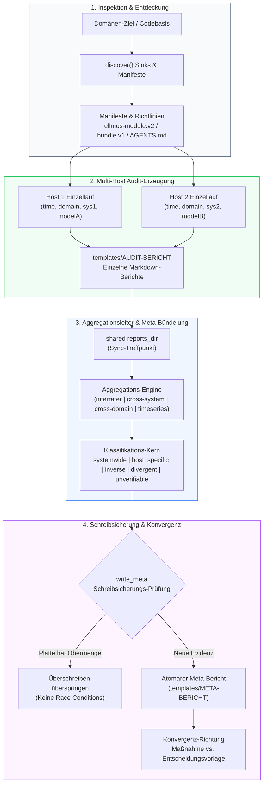
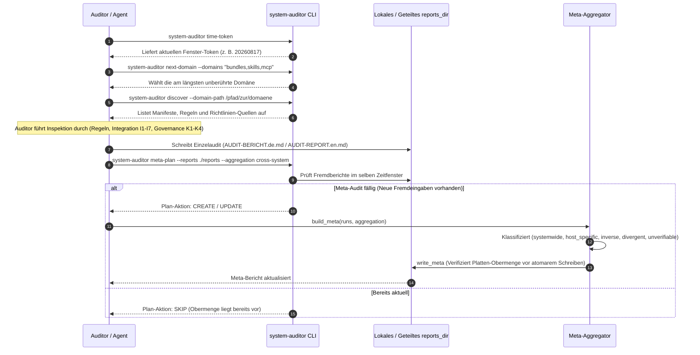

# system-auditor

[](https://github.com/ellmos-ai/system-auditor/actions/workflows/ci.yml)
[](tests/)
[](pyproject.toml)
[](pyproject.toml)
[](SECURITY.md)
[](SECURITY.md)
[](SECURITY.md)
[](https://github.com/astral-sh/ruff)
[](LICENSE)
[-lightgrey)](pyproject.toml)
[](https://github.com/ellmos-ai)
[](https://github.com/open-bricks/open-bricks)
[](pyproject.toml)
[](llms.txt)
[](MARKETING-LOG.txt)

**Belegbasierte Systemaudits über mehrere Maschinen — mit Meta-Bündelung.**

*[English version: `README.md`](README.md)*

---

## 🧭 Schnellnavigation

- [Wozu dieses Modul existiert](#wozu-dieses-modul-existiert)
- [Architektur & Systemfluss](#architektur--systemfluss)
- [Die drei Stufen](#die-drei-stufen)
- [Vier Token & Diskrete Zeitfenster](#vier-token--diskrete-zeitfenster)
- [Die Aggregationsleiter](#die-aggregationsleiter)
- [Kernfähigkeiten & Governance-Invarianten](#kernfähigkeiten--governance-invarianten)
- [Eine gültige Antwort je Zeitfenster](#eine-gültige-antwort-je-zeitfenster)
- [Schreibsicherung gegen Race Conditions](#schreibsicherung-gegen-race-conditions)
- [End-to-End Audit-Lebenszyklus](#end-to-end-audit-lebenszyklus)
- [Geschwisterwerkzeuge & Ökosystem-Matrix](#geschwisterwerkzeuge--ökosystem-matrix)
- [Installation & CLI-Nutzung](#installation--cli-nutzung)
- [Konfiguration](#konfiguration)
- [Sicherheit & Datenschutz](#sicherheit--datenschutz)
- [Entwicklung & Verifikation](#entwicklung--verifikation)
- [Lizenz](#lizenz)

---

## Wozu dieses Modul existiert

Der Auditor prüft ein komponiertes System in **drei Richtungen**:

1. **Regeltreue:** Verletzt ein beobachteter Systemzustand eine deklarierte Policy oder Konvention?
2. **Integration (Prüfklassen I1–I7):** Arbeiten Softwaremodule, Manifeste, Bundles und Bindings in der Praxis tatsächlich wie deklariert zusammen?
3. **Steuerungs-Konsistenz (Prüfklassen K1–K4):** Sind Steuerdateien, Register, Policies und bisherige Architekturentscheidungen untereinander widerspruchsfrei?

Das leitende Prinzip ist **Konvergenz**: Jeder Fund endet mit einer klaren Richtung — Realität an die Regel anpassen (eine konkrete Maßnahme) oder Regel an die Realität anpassen (eine Entscheidungsvorlage).

Zwei Maschinen, die dieselbe Domäne auditieren, kommen **nicht** zum selben Ergebnis. Das ist kein Mangel — es ist das Nützlichste daran, das Audit auf mehreren Systemen auszuführen.

### Ein gemessenes Beispiel

> **Befund:** *„Gardener-Governance hartkodiert den Laptop-Home-Pfad"* — `AGENTS.md` verweist auf `C:\Users\alice\…`.
>
> Auf **WORKSTATION-LG** ist das real: Der Pfad existiert dort nicht.
> Auf dem **Laptop** ist dieselbe Zeile korrekt und ergibt gar keinen Befund.

Eine einzelne Maschine sieht davon immer nur die Hälfte. Der Vergleich der gültigen Audits aller beteiligten Systeme liefert eine belegbare Einordnung, die ein Einzellauf strukturell nicht erzeugen kann:

| Klasse | Bedeutung | Auswirkung |
|---|---|---|
| `systemwide` | Alle Teilnehmer fanden es | Echte Systeminkonsistenz oder gebrochene Invariante |
| `host_specific` | Manche fanden es, andere haben fehlerfrei geprüft | Konfigurationsdrift oder Rechner-Divergenz |
| `inverse` | Hier ein Mangel, dort ausdrücklich in Ordnung | Host-Abhängigkeit (z. B. hartkodierter Pfad) |
| `divergent` | Gleicher Ort, *verschiedene* Regeln verletzt | Sync-Differenz oder divergierende Regelauslegung |
| `unverifiable` | Ein Teilnehmer hat dort nie geprüft | Ehrliche Nicht-Belegbarkeit (verhindert Schein-Drift) |

> [!NOTE]
> `unverifiable` ist die ehrliche Klasse. Ohne sie würde jede Lücke in der Prüfabdeckung eines Teilnehmers stillschweigend als echter Rechner-Unterschied erscheinen.

---

## Architektur & Systemfluss



---

## Die drei Stufen

```text
Karte     Was ist da?              ->  system-explorer   (optional)
Urteil    Was ist daran falsch?    ->  system-auditor    (dieses Modul)
Maßnahme  Was tun wir?             ->  Ticketsystem      (optional)
```

Eine Karte ist wertfrei, ein Ticket ist eine Handlung. Dazwischen liegt das Urteil: *welche Regel ist verletzt, was empfehlen wir, und ist die Regel selbst noch richtig?*

**Kein Nachbar ist Voraussetzung.** Erkannt werden sie genutzt; fehlen sie, liest der Auditor direkt und schreibt Dateien. In jede Richtung dasselbe Prinzip: *kennt sie, braucht sie nicht.*

---

## Vier Token & Diskrete Zeitfenster

Jedes Audit beantwortet vier Fragen, und jede Antwort ist ein unveränderlicher Token:

| Token | Frage | Beschreibung |
|---|---|---|
| `time` | *Wann?* | Das diskrete Zeitfenster, zu dem die Aussage gehört (z. B. `20260817`) |
| `domain` | *Was?* | Die auditierten Domäne (z. B. `bundles`, `skills`, `mcp`) |
| `system` | *Wo?* | Der Rechnername oder die geprüfte Umgebung (z. B. `WORKSTATION-LG`) |
| `auditor` | *Wer?* | Die Modell- oder Agentenidentität des Prüfers (z. B. `claude-3-5-sonnet`) |

### Warum diskrete Fenster statt gleitender Spannen

Ein gleitendes Fenster („gilt 14 Tage ab Lauf") macht Überlappung zur Gradfrage — jede Maschine müsste Paare vergleichen. Ein aus der Konfiguration abgeleitetes **Raster** macht daraus eine direkte Abfrage: Uhr fragen, Token bekommen. Zwei Maschinen, die nie direkt miteinander sprechen, leiten für denselben Moment denselben Token ab; „gleicher Zeitraum" wird zum einfachen Stringvergleich statt zum verteilten Konsensproblem.

---

## Die Aggregationsleiter

Einige Token festhalten, den Rest variieren lassen. **Eine Ursache darf eine Aggregation nur dann zuschreiben, wenn genau eine Dimension variiert** — sonst ist ein Unterschied mathematisch nicht identifizierbar. Diese Regel wird im Konstruktor erzwungen.

| Aggregation | Feste Dimensionen | Variierende Dimension | Was sie identifiziert |
|---|---|---|---|
| `interrater` | `time` + `domain` + `system` | **`auditor`** | Sind sich zwei Modelle auf demselben Rechner einig? |
| `cross-system-rater` | `time` + `domain` + `auditor` | **`system`** | Ein sauberer, modellkontrollierter Host-Effekt |
| `cross-system` | `time` + `domain` | **`system`** | Rechner-Unterschiede (Modell unkontrolliert; praxisnah) |
| `cross-domain` | `time` + `system` + `auditor` | **`domain`** | Bricht dieselbe Regel über verschiedene Domänen hinweg? |
| `timeseries` | `system` + `domain` | **`time`** | Wie hat sich die Domäne über aufeinanderfolgende Fenster entwickelt? |
| `timeseries-rater` | `system` + `domain` + `auditor` | **`time`** | Entwicklungskurve aus Sicht eines einzelnen Modells |
| `full-system` | `time` + `system` | `domain` **+** `auditor` | **Nur deskriptiv** — Bestandsaufnahme (`build_inventory`), kein Urteil |

---

## Kernfähigkeiten & Governance-Invarianten

| Invariante / Kernfähigkeit | Garantie | Verifikation & Technische Implementierung |
|---|---|---|
| **1. 100% Local-First & Zero-Egress** | Null Telemetrie, keine Analytik, keine externen HTTP-Anfragen oder Datenabflüsse | Offline-Ausführung mit Standardbibliothek; verifiziert per AST-Scan in `test_offline_and_zero_egress_invariants` |
| **2. Unprivilegierte Non-Elevation** | Strikter User-Mode; keine Administrator-/Root-Rechte, keine Systemeingriffe | Sichere Dateisystemgrenzen; keine Rechteausweitung erforderlich (`RunAsInvoker`) |
| **3. Deterministische Klassifikation** | Identische Eingaben erzeugen bit-für-bit identische Multi-Host-Audit-Urteile | Kanonische Sortierung von Befunden und Eingangsberichten in `system_auditor.meta` |
| **4. Identifizierbarkeits-Schutz** | Aggregationen mit >1 variierender Dimension dürfen keine kausalen Urteile fällen | Strikte Dimensions-Validierung im Konstruktor der `Aggregation`-Klasse |
| **5. Schreibsicherung (Write-Guard)** | Sichere parallele Läufe über Maschinen hinweg ohne zentrale Lock-Server | Vor-Schreib-Prüfung in `write_meta`; verweigert Überschreiben, wenn Platte bereits Obermenge enthält |
| **6. Diskrete Zeitfenster-Token** | Deterministische zeitliche Ausrichtung ohne verteilte Konsensprotokolle | Konfigurationsgesteuertes Zeitraster (`system_auditor.tokens`) direkt aus der Systemuhr |
| **7. Eine gültige Antwort je Fenster** | Eine einzige autoritative Antwort je Zeitfenster verhindert veraltete Doppelberichte | Überschreibung innerhalb des Zeitfensters; Historie erhält sich automatisch über Token-Namen |
| **8. Ehrliche Nicht-Belegbarkeit** | Schutz vor Schein-Drift: Ungeprüfte Pfade werden transparent deklariert | Klassifikationsstufe `unverifiable` trennt Beleg, geprüfte Abwesenheit und Nicht-Inspektion |
| **9. Multi-Host- & Lock-Härtung** | Geschützt gegen Cloud-Sync-Konfliktdateien und Multi-Agenten-Lock-Kollisionen | Gehärtete `.gitignore` mit Mustern für `*-conflict-*`, `*.sync-temp-*` und `LOCK.*` |
| **10. 48h Sicherheits- & 5-Tage-Triage-SLA** | Verbindliche Reaktionszeit bei Sicherheitsmeldungen und strukturierter Patch-Zyklus | Definierte SLA in `SECURITY.md`, qualifizierte Triage binnen 5 Werktagen via `security@open-bricks.org` |

---

## Eine gültige Antwort je Zeitfenster

```text
System A auditiert `bundles`   ->  Einzelaudit
System B auditiert `bundles`   ->  meta-2  (angelegt)
System C auditiert `bundles`   ->  meta-3  (dieselbe Datei, neu geschrieben)
```

Innerhalb eines Fensters wird das Meta-Audit **überschrieben, nicht archiviert**: „Was wissen wir über diese Domäne in diesem Fenster" hat eine gültige autoritative Antwort. `meta-2` neben `meta-3` stehen zu lassen würde zwei widersprüchliche Antworten hinterlassen.

**Die Historie ergibt sich von selbst.** Das vorherige Fenster hat einen anderen Zeit-Token, folglich einen anderen Dateinamen, und bleibt unberührt.

---

## Schreibsicherung gegen Race Conditions

Parallele Audits einer Domäne sind die *Voraussetzung* eines Meta-Audits, keine Kollision. Es gibt nichts auszuschließen, deshalb hält dieses Modul keine verteilten Locks.

- **Das Audit selbst ist read-only.** In der geprüften Domäne wird nichts verändert.
- **Die Klassifikation ist deterministisch.** Gleiche Eingaben erzeugen identischen Markdown-Text.
- **Schreibsicherungs-Prüfung:** `write_meta` liest das Ziel auf der Festplatte erneut. Liegt dort bereits eine Obermenge der geplanten Eingaben vor, wird das Neuschreiben sicher übersprungen.

---

## End-to-End Audit-Lebenszyklus



---

## Geschwisterwerkzeuge & Ökosystem-Matrix

`system-auditor` ist Teil des `ellmos-ai`-Ökosystems unter dem Dachverband `open-bricks`:

| Repositorium | Fokus | Integrationsrolle mit `system-auditor` |
|---|---|---|
| [`ellmos-ai/system-explorer`](https://github.com/ellmos-ai/system-explorer) | System-Kartierung | Liefert strukturierte Bestandsaufnahmen („Was ist da?") |
| [`ellmos-ai/system-auditor`](https://github.com/ellmos-ai/system-auditor) | Audit & Urteil | Bewertet Regeltreue, Integration und Steuerungs-Konsistenz |
| [`ellmos-ai/ellmos-controlcenter-mcp`](https://github.com/ellmos-ai/ellmos-controlcenter-mcp) | MCP Control Plane | Kontext-Packer, Werkzeug-Routing und Fähigkeits-Erkennung |
| [`ellmos-ai/ellmos-delegation-authority`](https://github.com/ellmos-ai/ellmos-delegation-authority) | Kryptographische Autorität | Nonce-basierte kryptographische Delegations-Grants |
| [`ellmos-ai/sqlite-transit-sync`](https://github.com/ellmos-ai/sqlite-transit-sync) | Datenbank-Transit | Zero-Egress SQLite-Replikation mit WAL-Checkpointing |
| [`ellmos-ai/ellmos-voice-io`](https://github.com/ellmos-ai/ellmos-voice-io) | Sprach-Interface | Zero-Egress lokale Sprachsynthese und Audio-Telemetrie |
| [`ellmos-ai/memoryhooker-provenance`](https://github.com/ellmos-ai/memoryhooker-provenance) | Provenienz-Tracking | Kryptographische Evidenz-Hashes und Audit-Trail-Validierung |
| [`ellmos-ai/workflowhooker-provenance`](https://github.com/ellmos-ai/workflowhooker-provenance) | Workflow-Attestierung | Unveränderliche Ausführungsprotokolle und Workflow-Verifikation |
| [`dev-bricks/automation-master`](https://github.com/dev-bricks/automation-master) | Aufgaben-Automatisierung | Orchestriert automatisierte Batch-Wartungsworkflows |
| [`dev-bricks/automizer-for-claude-desktop`](https://github.com/dev-bricks/automizer-for-claude-desktop) | Prozess-Diskriminierung | Atomare Konfigurations-Snapshots & sichere Staging-Queues |
| [`dev-bricks/WikiStub-Seed`](https://github.com/dev-bricks/WikiStub-Seed) | Dokumentations-Seeding | Strukturelle Wiki-Generierung und Dokumentations-Gerüste |
| [`file-bricks/ProSync`](https://github.com/file-bricks/ProSync) | Lokale Datensicherung | Sicherer Profilabgleich mit SQLite-WAL-Checkpoint-Schutz |
| [`doc-bricks/CleanMarkdown`](https://github.com/doc-bricks/CleanMarkdown) | Dokumenten-AST | Hochpräzise Markdown-AST-Validierung und Rendering |
| [`assistassets-ai/PrivacyMailDesk`](https://github.com/assistassets-ai/PrivacyMailDesk) | Datenschutz-Postfach | Zero-Egress Mail-Analyse und Anhang-Hygiene |
| [`research-line/prompt-archaeology-casestudy2`](https://github.com/research-line/prompt-archaeology-casestudy2) | Prompt-Archäologie | Wissenschaftliche Methodik und empirische Prompt-Evolutionslogs |
| [`open-bricks/open-bricks`](https://github.com/open-bricks/open-bricks) | Dachverband | Übergreifende Architekturstandards, Governance & Lizenzierung |

---

## Installation & CLI-Nutzung

```bash
# Entwicklungsinstallation
python -m pip install -e .

# Aktive Konfiguration und aufgelöstes Berichtsverzeichnis anzeigen
system-auditor config

# Aktuellen diskreten Zeitfenster-Token ermitteln
system-auditor time-token

# Nächste fällige Domäne in der Rotation ermitteln
system-auditor next-domain --domains "bundles,skills,mcp" --reports ./reports --system $HOSTNAME

# Konventionen, Manifeste und Richtlinien-Quellen einer Domäne entdecken
system-auditor discover --domain-path /pfad/zur/domaene

# Ausstehende Meta-Audits im aktuellen Fenster planen
system-auditor meta-plan --reports ./reports --aggregation cross-system
system-auditor meta-plan --reports ./reports --aggregation interrater

# Einzelaudits aus früheren Zeitfenstern identifizieren
system-auditor stale --reports ./reports --system $HOSTNAME

# Deterministischer Katalog-gegen-Pages-Check der Beispiel-Domäne pages-drift
system-auditor --json pages-drift \
  --modules-catalog "<HOME>/OneDrive/.TOPICS/.AI/.MODULES/modules.catalog.json" \
  --skills-registry "<HOME>/OneDrive/.TOPICS/.AI/.SKILLS/registry/components.json" \
  --bundles-catalog "<HOME>/OneDrive/.TOPICS/.AI/.BUNDLES/bundles.catalog.v1.json" \
  --site-dir "C:/_Local_DEV/repos/ellmos-ai.github.io"
```

`pages-drift` liefert Exit 0 ohne Drift, Exit 1 bei belegten Abweichungen und Exit 2 bei
unvollständigen/unlesbaren Eingaben. Neben Zahlen und öffentlichen Modul-IDs prüft der Befehl
die Regel: Ein auf `bundles.html` freigegebenes Rezept darf kein nichtöffentliches Modul nennen.
Der passende `domains[]`-Eintrag steht ausschließlich in der Beispielkonfiguration; eine nicht
vorhandene lokale Live-Config wird nicht erfunden.

---

## Konfiguration

```bash
cp config/system-auditor.config.example.json system-auditor.config.json
system-auditor config          # zeigt aufgelöste Konfiguration
```

Suchreihenfolge: `--config`, `SYSTEM_AUDITOR_CONFIG`, `./`, `./config/`, `~/.system-auditor/`.

```json
{
  "time_grid": {
    "unit": "weeks",
    "step": 1,
    "anchor": "2026-01-05"
  },
  "reports_dir": "./reports",
  "policy": {
    "cross-system": "always",
    "interrater": "always",
    "cross-domain": "on-demand"
  }
}
```

> [!IMPORTANT]
> `reports_dir` ist der Treffpunkt aller Maschinen. Er muss in einem cloud-synchronisierten Ordner liegen, den alle teilnehmenden Systeme teilen. In einem rein host-lokalen Verzeichnis können keine Meta-Audits entstehen.

---

## Sicherheit & Datenschutz

`system-auditor` folgt einem strikten **Local-First- & Zero-Egress**-Modell. Es enthält null Telemetrie, erfordert keine Internetverbindung, operiert rein mit unprivilegierten Benutzerrechten und setzt auf deterministische Schreibsicherungen.

Vollständige Details, unterstützte Versionen und Sicherheitskontakte finden Sie in [`SECURITY.md`](SECURITY.md).

---

## Entwicklung & Verifikation

```bash
# Testsuite ausführen (inklusive Metadaten-Vertragstests)
python -m pytest -q

# Ruff-Linter ausführen
ruff check src tests
```

---

## Lizenz

MIT — siehe [LICENSE](LICENSE) und [THIRD_PARTY_LICENSES.md](THIRD_PARTY_LICENSES.md).


## Starter

Dieses Modul liefert die anbieterneutralen Rollenstarter `START.bat` und `start.sh` im
Wurzelverzeichnis. Sie werden aus `roles[]` in `ellmos-module.v2.json` von COMA erzeugt
(`python -m coma starters generate --manifest ellmos-module.v2.json --output-dir .`) und
deshalb neu erzeugt statt von Hand bearbeitet. Jeder Starter bevorzugt die unified-gui-Konsole
und fällt auf COMA zurück, das beim Start Anbieter, Modell und Reasoning-Aufwand abfragt.

Anbieterspezifische Starter unter `bin/providers/` gibt es hier bewusst **nicht** -- anders als
bei ticket-master: Der Auditor hat keinen eigenen handgeschriebenen Dispatcher, eine Datei je
Anbieter würde also nur argv-Wissen verdoppeln, das COMA bereits hält. Der Start über eine
Task-Rolle (`taskplan launch --label system-auditor`) bleibt gleichwertig und nutzt dieselbe
Deklaration. Entschieden in Ticket T-20260906-249053451.
